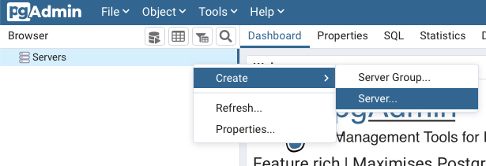
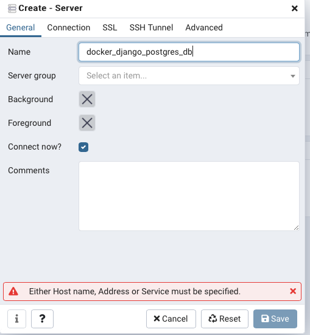
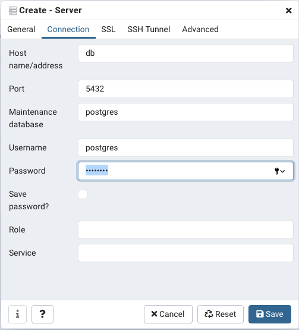
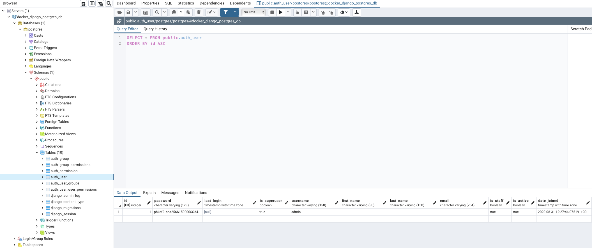

# 🐍 Flask + PGSQL + Docker Template

## 🖥️ Tecnologias usadas:

    - Flask
    - SQLALCHEMY
    - Docker
    - Postgres

## 🌟 Como usar o template

1. Se você for usar algum tipo de biblioteca adicional no projeto flask, lembre-se de adicionar ao arquivo `requirements.txt` antes de prosseguir.

De forma automatica você pode utilizar o comando:

```bash
pip freeze > requirements.txt
```

2. Mude o arquivo `.env.example` para `.env` e preencha com os dados solicitados.

```.env
# APP

DEBUG=
SECRET_KEY=

# POSTGRES

POSTGRES_DB=
POSTGRES_USER=
POSTGRES_PASSWORD=

# PGADMIN

PGADMIN_DEFAULT_EMAIL=
PGADMIN_DEFAULT_PASSWORD=

```

## DevContainer VSCODE 📭

Se você usa o VsCode com a extensão `devcontainers` você pode abrir o projeto e começar a desenvolver. Basta apenas que você inicie e selecione a Workspace `web`.

## Usando o Docker 🐬

Caso você não use o VsCode você terá que usar o docker para fazer a migração, iniciar o server e etc.

Com isso basta apenas que você sempre o rode o comando do docker mais a operação desejada.

Para subir o banco de dados:

```bash
$ docker-compose up db
```

Para subir a aplicação:

```bash
$ docker-compose up app
```

Lembre-se de entrar no container e realizar as migrações:

```bash
$ flask db init && flask db migrate
```

## Usando o PGADMIN 🎟️

Se por acaso você for usar o PGADMIN para fazer a manipulação de dados do postgres. Aqui vai umas instruções.

1. Abra o PGADMIN em `localhost:5050` em algum navegador.

2. Faça login com as informações passadas no arquivo `.env`

```.env
PGADMIN_DEFAULT_EMAIL=
PGADMIN_DEFAULT_PASSWORD=
```

4. Crie uma conexão com o postgres usando o host `db`



1. O nome que terá que ser passado é `docker_django_postgres_db`. ( Lembre-se que esse nome pode ser alterado no arquivo compose )



6. Insira as informações solicitadas, ambas podem ser consultadas no arquivo `.env` que você tem. ( Ou se preferir no `settings.py`)



1. E pronto, agora é só conferir as informações usando a barra lateral do PGADMIN.


